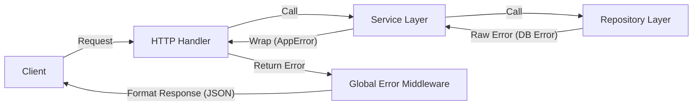

# 🛡️ Go Service Pattern: Advanced Error Handling

이 문서는 본 프로젝트(`go-playground`)에서 채택한 **계층형 아키텍처 기반의 에러 처리 전략**을 상세히 설명합니다.

Java/Spring 개발자가 Go로 넘어올 때 가장 낯설어하는 부분이 `if err != nil` 패턴입니다. 본 가이드에서는 단순한 에러 체크를 넘어, 대규모 시스템에서도 유지보수 가능한 **구조적 에러 핸들링(Structured Error Handling)** 패턴을 제시합니다.

---

## 1. 핵심 철학 (Core Philosophy)

1.  **Don't Just Check Errors, Handle Them Gracefully**: 에러를 단순히 로그로 찍고 끝내는 것이 아니라, 사용자에게 의미 있는 메시지를 전달하고 시스템의 안정성을 확보해야 합니다.
2.  **Separation of Concerns**: 비즈니스 로직(Service)은 HTTP 상태 코드(400, 404, 500)를 몰라야 합니다. 이는 Handler(Controller)의 역할입니다.
3.  **Centralized Management**: 에러 처리 로직이 각 핸들러에 파편화되지 않고, 한 곳에서 일관되게 관리되어야 합니다.

---

## 2. 아키텍처 흐름 (Architecture Flow)



### A. Domain Layer: 에러 정의 (`internal/domain/errors.go`)
프로토콜(HTTP, gRPC)에 독립적인 순수 에러 정의입니다.

*   **Standard Errors**: `ErrBadRequest`, `ErrNotFound` 등 비즈니스 로직에서 사용할 표준 에러 변수.
*   **AppError 구조체**:
    *   `ServiceError`: 추상화된 에러 카테고리 (로직 분기용)
    *   `Detail`: 실제 발생한 기술적 에러 (서버 로깅용, 민감 정보 포함 가능)
    *   `Message`: 클라이언트에게 보여줄 친절한 메시지

### B. Service Layer: 에러 래핑 (Wrapping)
Repository나 외부 라이브러리에서 발생한 로우 레벨 에러를 `AppError`로 감싸서 반환합니다.

```go
if err != nil {
    return &domain.AppError{
        ServiceError: domain.ErrInternalFailure, // 카테고리 지정
        Detail:       err,                       // 원본 에러 보존 (로깅용)
        Message:      "게시글 목록을 불러올 수 없습니다.", // 사용자 메시지
    }
}
```

### C. Handler Layer: 에러 위임 (Delegation)
핸들러는 복잡한 에러 처리 로직(`if err != nil { ... }`)을 수행하지 않고, 에러 발생 시 즉시 리턴하여 **Global Error Handler**에게 처리를 위임합니다.

```go
// Before: 각 핸들러마다 반복되는 에러 처리
if err != nil {
    return c.JSON(http.StatusInternalServerError, ...)
}

// After: 깔끔한 위임
if err != nil {
    return err
}
```

### D. Global Error Handler: 중앙 집중 처리 (`internal/handler/error_handler.go`)
Echo 프레임워크의 `HTTPErrorHandler`를 커스터마이징하여 모든 에러를 가로챕니다.

1.  **Type Assertion**: 발생한 에러가 우리가 정의한 `AppError`인지 확인합니다.
2.  **Mapping**: `AppError.ServiceError` 타입에 따라 적절한 HTTP Status Code(400, 404, 500)를 결정합니다.
3.  **Logging**: `AppError.Detail`에 담긴 실제 기술적 에러를 서버 로그에 기록합니다.
4.  **Response**: `AppError.Message`를 JSON 응답으로 클라이언트에게 전송합니다.

---

## 3. 이 패턴의 장점 (Benefits)

*   **비즈니스 로직의 순수성 유지**: Service 계층이 `net/http` 패키지에 의존하지 않아도 됩니다.
*   **코드 중복 제거**: 수많은 핸들러 함수에서 에러 처리 코드가 사라져 코드가 매우 간결해집니다.
*   **보안성 강화**: 내부 DB 구조나 쿼리 에러 등이 실수로 클라이언트에게 노출되는 것을 원천 차단합니다.
*   **확장성**: 나중에 gRPC 인터셉터 등을 추가할 때도 동일한 `AppError` 구조를 재활용할 수 있습니다.
